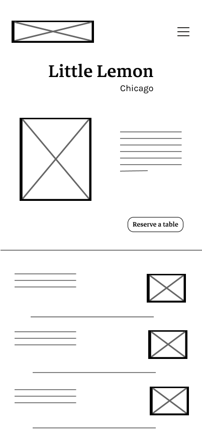
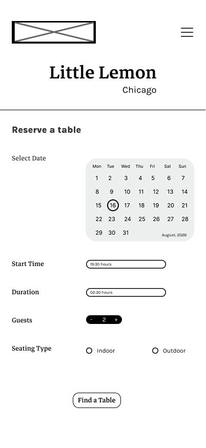
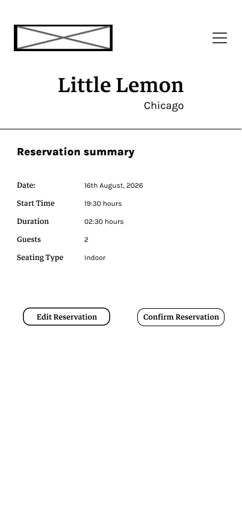
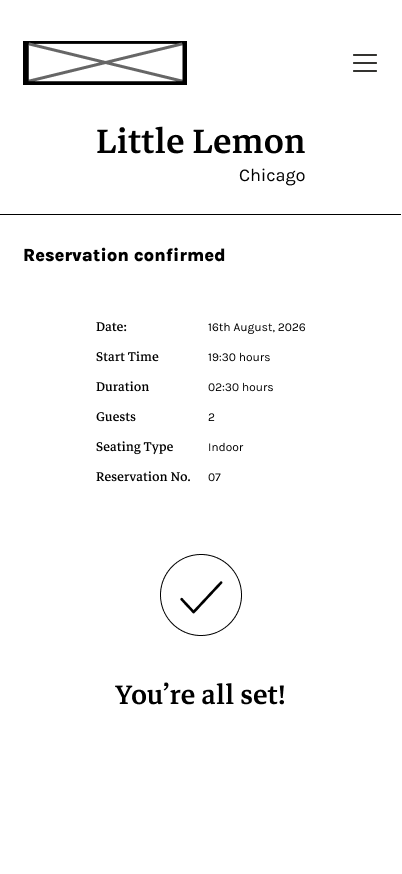

# Little Lemon – Table Reservation Prototype

## About the Project

This project was developed as part of the **Meta Front-End Developer Professional Certificate**. It recreates the reservation journey for **Little Lemon**, a fictional Mediterranean restaurant introduced throughout the certification program.

Built using **React, JavaScript, HTML, and CSS**, the project focuses on implementing a multi-screen reservation flow while applying concepts such as component-based architecture, state management, form handling, validation, and user interaction.

---

## Reservation Journey

### 1. Home Page

The journey begins with the restaurant's landing page, which introduces Little Lemon through a hero section, restaurant information, and featured menu items. The **"Reserve a Table"** button guides users into the reservation flow.

### 2. Booking Page

Users can enter their reservation details, including:

- Date
- Start time
- Duration
- Number of guests
- Seating preference (Indoor or Outdoor)

Form validation ensures that all required fields are completed before moving to the next step.

### 3. Summary Page

Before confirming the reservation, users can review all the selected details and return to the previous screen to make changes if necessary.

### 4. Confirmation Page

After confirming the reservation, users receive a confirmation screen displaying their reservation details along with a unique booking number.

---

## Technologies Used

- React
- JavaScript
- HTML
- CSS
- Figma

---

## Features

- Four-screen reservation flow
- Component-based architecture
- State management using React Hooks
- Form validation
- Reservation summary review
- Dynamic reservation number generation
- Responsive layouts
- Accessible form controls and navigation

---

## Project Structure

```text
src
├── components
│   ├── Header.js
│   ├── ReservationLayout.js
│   └── RestaurantBanner.js
├── pages
│   ├── HomePage.js
│   ├── BookingPage.js
│   ├── SummaryPage.js
│   └── ConfirmationPage.js
├── assets
├── App.js
├── App.css
└── index.css
```

---
## Design

The interface was designed in Figma before being implemented in React.

**Figma Design:** [View the Figma file](https://www.figma.com/design/b89Ut8MLy31sKAMoeFUid3/little-lemon-restaurant?node-id=4-9&t=BtLW7R6OG5oxviZr-1)

#### Wireframes:

<p align="center">
  
  &nbsp;&nbsp;&nbsp;
  
  &nbsp;&nbsp;&nbsp;
  
  &nbsp;&nbsp;&nbsp;
  
</p>

#### Final Screens:

<p align="center">
  
  &nbsp;&nbsp;&nbsp;
  
  &nbsp;&nbsp;&nbsp;
  
  &nbsp;&nbsp;&nbsp;
  
</p>


## Installation

Clone the repository:

```bash
git clone https://github.com/pushti280/little-lemon.git
```

Navigate to the project directory:

```bash
cd little-lemon
```

Install the dependencies:

```bash
npm install
```

Run the project:

```bash
npm start
```

The project will run locally at:

```text
http://localhost:3000
```
